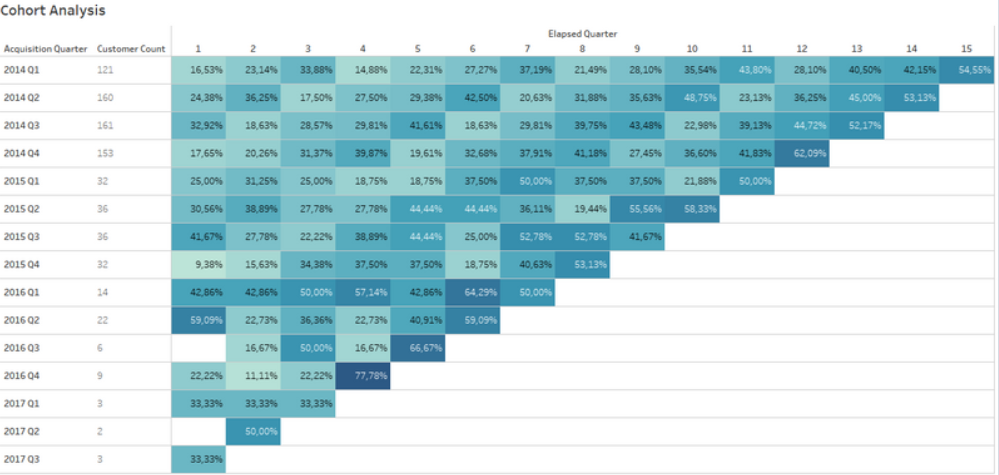

# Cohort, CLV, and RFM Analysis

## Superstore Business

A superstore is a type of large retail store that sells a wide variety of products in one location. The products offered typically cover a wide range of categories, from groceries to apparel to electronics to appliances to office supplies. Superstores often function as a one-stop shop that meets consumers' needs in a single visit, offering convenience, wide selection and competitive prices.

## Business Understanding

Superstore that sell a variety of products in one location face the challenges of market competition and increasing consumer demand. 

- How do you identify different customer behaviors in different market segments?
- How do you assess the customer lifetime value (CLV) of each customer?
- How to group customers based on their buying behavior?
- How to implement appropriate marketing strategies based on cohort and RFM data?
- What is the impact of increased purchase frequency or customer loyalty on long-term revenue?

## Data Understanding

This data is about the customers as well as the products sold in the Superstore. This dataset provides important information about transactions, customers, and products.

- Source Data: https://www.kaggle.com/datasets/vivek468/superstore-dataset-final
- The dataset has 21 columns and 9994 rows.
- Data Dictionary:
- Row ID => Unique ID for each row.
- Order ID => Unique Order ID for each Customer.
- Order Date => Order Date of the product.
- Ship Date => Shipping Date of the Product.
- Ship Mode=> Shipping Mode specified by the Customer.
- Customer ID => Unique ID to identify each Customer.
- Customer Name => Name of the Customer.
- Segment => The segment where the Customer belongs.
- Country => Country of residence of the Customer.
- City => City of residence of of the Customer.
- State => State of residence of the Customer.
- Postal Code => Postal Code of every Customer.
- Region => Region where the Customer belong.
- Product ID => Unique ID of the Product.
- Category => Category of the product ordered.
- Sub-Category => Sub-Category of the product ordered.
- Product Name => Name of the Product
- Sales => Sales of the Product.
- Quantity => Quantity of the Product.
- Discount => Discount provided.
- Profit => Profit/Loss incurred.

## Exploratory Data Analysis

### 1. Analysis Customer

From the data, there are 5 customers with the highest purchase frequency, where William Brown customers recorded the most transactions with a total of 37 purchases. This analysis provides insight into the customers who frequently shop at this retail store and there are 5 customers with the highest total transaction value, with customer Sean Miller recording the highest purchase amount of $25,043.

### 2. Cohort Analysis

The graph above shows the predicted Retention Rate for each upcoming quarter. The highest cohort percentage is in the 4th quarter, with 77.78%. This shows that cohort analysis can help identify customers who have the potential to repurchase or not.

### 3. Trend Retention Rate

The graph above shows an upward trend until the 15th quarter, with retention reaching 54.5%. This indicates that there are factors that encourage customers to make repeat purchases every quarter, or it could also indicate that these customers are very loyal and qualified.

### 4. RFM Analysis

The bar graph above shows the number of customers with a certain combination of RFM (Recency, Frequency, and Monetary) scores. For example, customers with a score of R=1, F=5, M=5 perform well, shop frequently, and make high value purchases. In contrast, customers with a score of R=5, F=1, M=1 rarely shop and spend little money.

### 5.CLV Analysis

The percentage table above shows that the profit from each customer purchase will continue to grow as they become customers. It can be seen that customers who have been with the company for a longer period of time have a higher profit value. For example, in the first quarter of 2014, an early customer made a profit of $615, while by the 15th quarter, after several purchases, the customer's profit had only dropped to $3,353.

## Superstore Dashboard

link tableau public: https://public.tableau.com/app/profile/nofita.nur.aini/viz/SuperstoresAnalysis_17288841906630/COHORT?publish=yes
